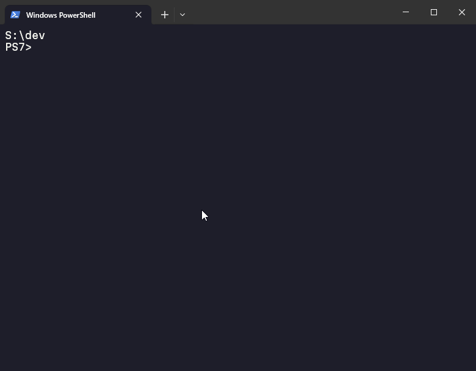
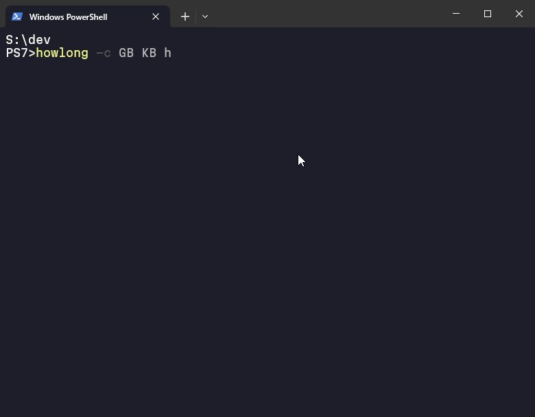
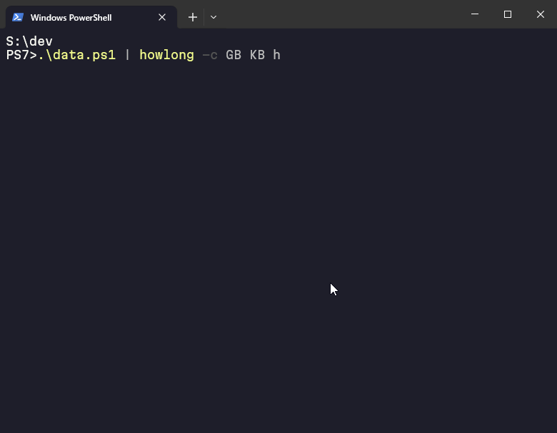
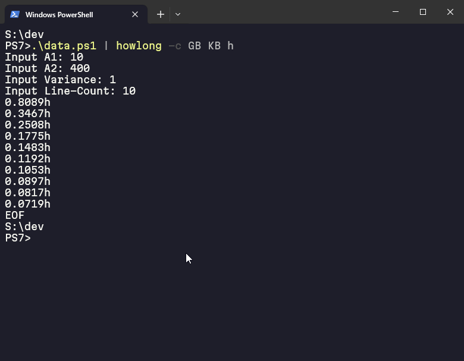

# howlong
ETA for a download/upload size on a download/upload speed with given time format.
Normal-mode for quick use and Continuous-mode for streamed-input use

# The Inception
Due to a slow internet and the desire to download large files (read: video games), I always find myself opening a calculator and going:

120 gigabytes.... times 1024 to megabytes... times 8 to megabits... divide by 3 megabits per second... divide by 3600 to hours... 91 hours, sigh... divide by 24 to days... 3.7 days of cumulative downloads...

And so I finally faced myself in the mirror, realized I'm a programmer, and decided to write a simple tool to make life easier and further smoothen the brain.

Even the Wizards created cantrips to make life easier, so why can't I?

# How does it work
## Normal Usage
`howlong 120GB 3Mb h` means a download size of 120 Giga**B**ytes, a per-second download speed of 3 Mega**b**its, and to display in hours.
The output will be `91.0222h`

Of course, it can be upload speed as well. This tool just maths.

### Example
```
$howlong 420MB 1Mb m
>56.0000m
```
The following GIF also demonstrates further usage


## Continuous Mode
Continuous mode is started with the `--continuous` or `-c` flag and supplied with `{unit} {unit} [time-unit]`
Then, input is taken in the form of `{down-size} {speed}` and an output is given in the form of `duration` concatted with `time-unit`

### Example
```
$howlong -c GB KB h
>10 420 
6.9350h
>10 369
7.8933h
EOF
```
The program will output EOF when done.

The following GIFs also demonstrate how you can pipe to the command


---



---




# Help
howlong {size[unit]} {speed[unit]} [time-unit]

size and speed are a float with decimal precision of 1 (for now)

unit uses the convention of B for Byte and b for bit:
- GB (size Default)
- Gb
- MB
- Mb (speed Default)
- KB
- Kb
- B
- b

unit given to speed are treated on a per-second basis. (10Mb means 10 Megabits per second, often seen as 10Mbps)

time-unit has the following options:
- d
- h (default)
- m
- s

## Examples
Some examples leveraging default usage
```
$howlong 10 3
>7.5850h
$howlong 10GB 3Mb h
>7.5850h
$howlong 120GB 3 d
3.7926d
```

# Installation
Cloning the repository and building with `go install .` is the recommended install method until v1.0

# Onwards to 1.0!
+ Input from file (tsv) for --continuous mode
+ Persistent configuration (changing defaults, etc.)
+ Sufficient Tests
+ Sufficient feedback
+ Boost Morale
+ Figure out how the vims to automagically release binaries on Github


# Afterwords
The wizard has 104 GigaMana and a casting speed factor of 10 MMps.
The Fireball has already been cast and I have been utterly annihi---
Primeagen coconut oil when?
